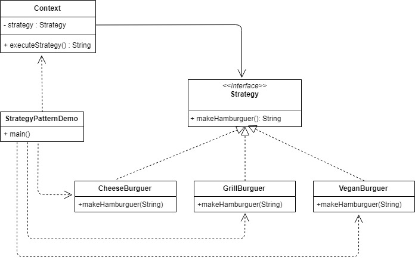

# Strategy
Define una familia de algoritmos, encapsula cada uno de ellos, y los hace intercambiables. Este patrón de diseño permite que el algoritmo varíe independientemente de los clientes que lo utilizan.

Cualquier programa que ofrezca un servicio o función determinada, que pueda ser realizada de varias maneras, es candidato a utilizar el patrón estrategia. Puede haber cualquier número de estrategias y cualquiera de ellas podrá ser intercambiada por otra en cualquier momento, incluso en tiempo de ejecución.

## Integrantes
 - Isabela Muriel 
 - Juan José Parra
 -  Luisa María Vásquez

## Ejemplo

Hay muchas variedades de hamburguesas: hamburguesa vegetariana, hamburguesa con queso, hamburguesa de pollo a la parrilla y hamburguesa doble con queso, por nombrar algunas. Todos ellos comparten el mismo formato: el pan superior + relleno + pan inferior.

Es el relleno el que hace que cada hamburguesa sea diferente. Una hamburguesa con queso tiene queso y carne en el medio, mientras que una hamburguesa de pollo a la parrilla tiene relleno de pechuga de pollo.

Recapitulemos la definición del patrón de estrategia en términos de hamburguesas. ¿Cuál es la familia de algoritmos en términos de hamburguesas? Es la familia de diferentes rellenos:

 - relleno para hamburguesa de pollo= [pechuga de pollo asada] 
 -  relleno para hamburguesa de queso= [queso + carne asada]  
 - relleno para hamburguesa doble= [queso + carne asada + queso + carne asada]

Son encapsulados e intercambiables entre sí. Cambia el relleno de la hamburguesa de pollo por el de la hamburguesa con queso y obtendrás una hamburguesa con queso.

Puedes pedir cualquier hamburguesa que te guste. Pero para un chef, hacer una hamburguesa sigue el mismo procedimiento general: preparar el pan, cocinar el relleno y luego colocarlo  entre los panes superior e inferior.

El anterior ejemplo fue implementado en el lenguaje **Java** con el objetivo de evidenciar el comportamiento del patrón de diseño.

## Modelo de Clases

## Descripción ejemplo
Comenzando en la clase StrategyPatternDemo este crea 3 contextos diferentes basados en las diferentes estrategias que se pueden dar, simulando así los pedidos de diferentes tipos de hamburguesa. Posteriormente imprimirá los ingredientes de cada una utilizando el mismo método, pero este se comportará de manera diferente dependiendo del contexto. Más específicamente la clase StrategyPatternDemo llama al método executeStrategy de la clase Context con una base, el cual llama a las clases que implementan la interfaz Strategy y según el contexto ejecuta el método que se adecue a este, retornando un valor específico según la estrategia usada.

## Referencias

 1.  https://sourcemaking.com/design_patterns/strategy
 2.  https://es.wikipedia.org/wiki/Strategy_(patr%C3%B3n_de_dise%C3%B1o)
 3.  https://medium.freecodecamp.org/how-can-you-learn-the-strategy-design-pattern-make-a-hamburger-a6ad4332b838
 4.   https://www.geeksforgeeks.org/strategy-pattern-set-1/

